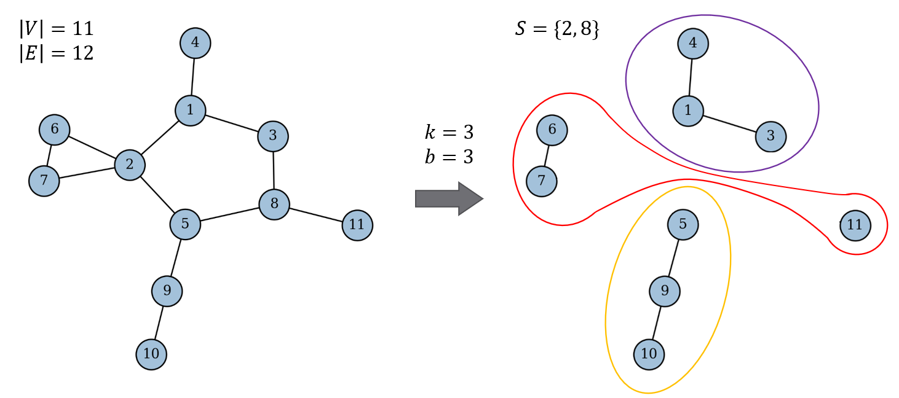

# A Configurable Greedy Heuristic for the Capacitated Vertex Separator Problem

This repository contains a **C++** implementation of a configurable **greedy heuristic** for the **Capacitated Vertex Separator Problem (CVSP)** – a combinatorial optimisation problem on graphs with applications to complex networks – developed as part of my Bachelor's thesis in Management Engineering.

The proposed algorithm constructs a feasible solution through iterative vertex removal followed by a bin-packing feasibility check, and provides multiple configurations based on different vertex-selection rules. Randomised tie-breaking allows repeated executions to explore different feasible solutions.

The implementation was evaluated on benchmark instances from the literature, comparing the different heuristic configurations with reference results reported for an exact branch-and-cut method.

## Table of Contents

- [Problem Definition](#problem-definition)
  - [Illustrative Example](#illustrative-example)
  - [Applications to Complex-Network Protection](#applications-to-complex-network-protection)
  - [Further Reading](#further-reading)
- [Heuristic Approach](#heuristic-approach)
  - [Algorithm Overview](#algorithm-overview)
  - [Vertex-Selection Rules](#vertex-selection-rules)
  - [Algorithm Configurations](#algorithm-configurations)
- [Code Architecture](#code-architecture)
- [Repository Structure](#repository-structure)
- [Input and Output](#input-and-output)
- [Requirements](#requirements)
- [Building and Running](#building-and-running)
- [Reproducibility](#reproducibility)
- [Experimental Results](#experimental-results)
- [Known Limitations](#known-limitations)
- [References](#references)
- [Citation](#citation)
- [License](#license)

## Problem Definition

Let $G = (V, E)$ be a simple undirected graph, and let $k$ and $b$ be positive integers. The **Capacitated Vertex Separator Problem (CVSP)** asks for a minimum-cardinality set $S \subseteq V$, called the **separator**, such that the remaining vertices $V \setminus S$ can be partitioned into at most $k$ disjoint subsets, called **shores**, satisfying the following conditions:

- each shore contains at most $b$ vertices;
- no path connects vertices assigned to different shores.

The objective is therefore to **minimise $|S|$**.

Note that a shore may contain multiple connected components, whereas a connected component cannot be split across different shores.

Once a candidate separator has been constructed, checking its feasibility amounts to assigning the sizes of the remaining connected components to at most $k$ bins of capacity $b$. Determining whether such an assignment exists constitutes an instance of the **Bin Packing Problem (BPP)**, in which connected components correspond to items and shores correspond to bins.

The CVSP is **NP-hard**, which motivates the use of heuristic methods when good feasible solutions are required within short computation times.

### Illustrative Example

The figure below illustrates an optimal solution to a CVSP instance with $k = 3$ and $b = 3$, defined on an 11-vertex simple undirected graph. Removing vertices 2 and 8 yields a separator of cardinality two and produces connected components that can be assigned to three shores, each containing at most three vertices.

  

### Applications to Complex-Network Protection

The CVSP can also provide a simplified model for the protection of complex networks. Under suitable assumptions, removing a vertex may represent immunising or otherwise protecting a node, while the parameters $k$ and $b$ constrain the number and maximum size of the disconnected groups that remain. The objective then reflects the need to limit the cost of the intervention while reducing the impact of contagion processes or other phenomena that propagate through the network.

### Further Reading

For a more detailed treatment of the CVSP – including its theoretical properties, integer-programming formulations, and applications to complex-network protection – see the Bachelor's thesis on which this project is based. Full bibliographic details are provided in [References](#references).

## Heuristic Approach

Since the CVSP is NP-hard, exact solution methods may become computationally expensive as the size of the instance increases. Heuristic approaches trade the guarantee of optimality for the ability to produce good feasible solutions within limited computation times, making them suitable for large instances or time-constrained applications.

Hence, the design of the proposed heuristic is motivated by its potential application to graphs representing real-world networks. Many such networks exhibit small-world characteristics and heterogeneous degree distributions, sometimes associated with scale-free structure. In these settings, **targeted removal of highly connected vertices** may fragment the network more effectively than random removal. The algorithm therefore prioritises vertices that are considered critical according to **local connectivity** measures, such as their degree or the connectivity of their neighbourhood.

### Algorithm Overview

The proposed method is a **constructive greedy heuristic** that builds a candidate separator by iteratively selecting and removing one vertex at a time from the graph.

1. Starting from the original graph, the algorithm examines each connected component whose cardinality exceeds $b$.

2. A vertex is selected according to the chosen configuration and removed from the graph.

3. The resulting subcomponents are then processed **recursively** until every remaining connected component contains at most $b$ vertices.

The set of removed vertices constitutes the candidate separator.

Once the vertex-removal phase is complete, if the number of the resulting connected components does not exceeds $k$, then the candidate separator is also feasible. Otherwise, the feasibility of the candidate separator is assessed through the corresponding BPP instance. Since the BPP is NP-hard, the implementation handles this subproblem using the following heuristic procedure.

1. **Best-Fit Decreasing (BFD)** bin-packing heuristic – The connected components of the residual graph are ordered by decreasing size, and each component is assigned to the shore that leaves the smallest residual capacity; a new shore is created when none of the existing ones has sufficient space.

2. If BFD produces an assignment using at most $k$ shores, the set of removed vertices defines a feasible CVSP solution. If more than $k$ shores are used, however, **this does not necessarily imply that no feasible assignment exists**: since BFD does not guarantee a minimum number of shores, another packing could potentially assign the same components to at most $k$ shores. Only an optimal solution to the corresponding BPP instance could determine whether such an assignment is impossible. In the current heuristic implementation, an additional vertex-removal phase is required in this case but is not implemented, as discussed in [Known Limitations](#known-limitations).

**All algorithm configurations share this structure** and **differ only in the ordered rules** used to select the vertex removed at each iteration.

### Vertex-Selection Rules

At each removal step, the candidate set consists of the vertices belonging to the oversized connected component currently being processed. Each candidate vertex is assigned a score according to one of the following local connectivity rules.

Let $N(v)$ denote the neighbourhood of vertex $v$, and let $\deg(v)$ denote its degree in the current residual graph.

| Symbol | Rule | Score | Interpretation |
|:------:|------|-------|----------------|
| **D** | **Maximum degree** |$\deg(v)$ | Prioritises vertices having the largest number of direct neighbours. |
| **S** | **Maximum sum of adjacent degrees** | $\displaystyle \sum_{u \in N(v)} \deg(u)$ | Prioritises vertices whose neighbourhood has the greatest overall connectivity. |
| **A** | **Maximum adjacent degree** | $\displaystyle \max_{u \in N(v)} \deg(u)$ | Prioritises vertices adjacent to a highly connected vertex. |

The scores are recomputed on the current residual graph, so they may change after each vertex removal.

When a configuration contains **multiple rules**, they are applied sequentially rather than combined into a single score. The first rule retains all candidates attaining its maximum value; if more than one candidate remains, the next rule is applied only to that reduced set. The process stops as soon as a single vertex remains.

If the specified rules do not resolve the tie, one of the remaining candidates is selected uniformly at **random**.

### Algorithm Configurations

The implementation provides six algorithm configurations, each defined by an ordered sequence of vertex-selection rules. The arrow $ \rightarrow $ indicates the order in which the rules are applied. Random selection is used whenever the preceding rules leave more than one candidate.

| Configuration | Rule sequence | Description |
|:-------------:|---------------|-------------|
| **R** | Random | Selects a vertex uniformly at random from the current oversized component. |
| **MD** | D $ \rightarrow $ Random | Applies the D rule. |
| **MS** | S $ \rightarrow $ Random | Applies the S rule. |
| **MDS** | D $ \rightarrow $ S $ \rightarrow $ Random | Applies the D rule first and uses the S rule to break ties. |
| **MSD** | S $ \rightarrow $ D $ \rightarrow $ Random | Applies the S rule first and uses the D rule to break ties. |
| **MDA** | D $ \rightarrow $ A $ \rightarrow $ Random | Applies the D rule first and uses the A rule to break ties. |

The order of the rules is significant. For example, **MDS** and **MSD** use the same two connectivity measures but may select different vertices because their first rule filters the candidate set before the second rule is applied.

The **R** configuration serves as a topology-independent baseline for assessing the contribution of the connectivity-based selection rules.